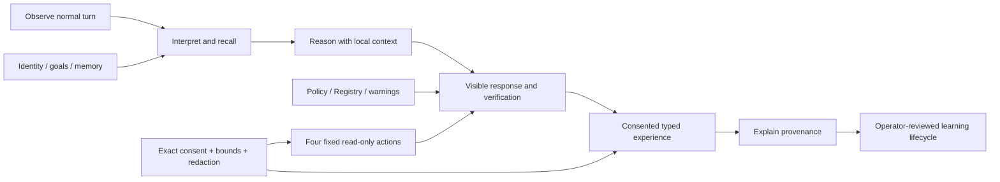

# Proto-Mind Contest Showcase v1

Target date: 2026-07-21

## One-Line Pitch

Proto-Mind is a local-first cognitive operating system that preserves continuity, turns operator-consented cognitive turns into inspectable evidence, and keeps every executable capability behind deterministic safety gates.

## What The Demo Proves

| Capability | Visible evidence | Safety boundary |
|---|---|---|
| Cognitive continuity | Identity, focus, memory, tasks, experiments, predictions, and skills appear in one live view | Local stores remain operator-inspectable |
| Experience | One normal turn becomes typed, provenance-linked events | Exact per-session consent, redaction, hard memory bounds, restart expiry |
| Explainability | `/experience episode latest` connects Observe, Interpret, Recall, Respond, Memory, Reflect, Verify, and exact source events | No hidden full prompt, LLM summary, or automatic lesson promotion |
| Learning | Provenance-verified lessons can be recalled, reviewed, transitioned, audited, operator-authored as a skill contract, and revalidated against current Skill Library state | Evidence/store-bound confirmations; bounded receipts; global duplicate/store-hash readiness; no automatic synthesis, skill write, promotion, or execution |
| Action | A fixed read-only command can be dry-run and executed with an exact phrase | Four-command allowlist, fixed callbacks, no shell or free-form dispatch |
| Governance | Context, warnings, Registry, Policy, and doctors remain visible | Context Injection disabled; unknown warnings and blockers gate the demo |

## Architecture Story



The important distinction is that capabilities are not the intelligence. The normal cognitive turn produces local continuity; Experience records explainable evidence only after explicit consent; the runner remains a narrow governed tool.

## Three-Minute Demo

Start Proto-Mind:

```bash
cd /path/to/proto_mind
scripts/run_cli.sh
```

### Act 1: Continuity

```text
/showcase status
/showcase demo
```

Narration:

> Proto-Mind reads its current identity, focus, memory, work state, warnings, and safety posture locally. This view does not call a model or mutate state.

### Act 2: Consent And Experience

```text
/experience preview
```

Run the exact session-bound command printed by preview, then ask one normal question:

```text
What do you remember about our current Proto-Mind direction?
/experience events --last 7
/experience episode latest
/experience inspect <latest_event_id>
```

Narration:

> The normal response is followed by a visible capture indicator. The turn becomes seven compact typed events, then a deterministic read-only episode connects what was observed, recalled, answered, considered for memory, reflected on, and verified. Credential-like content is redacted, evidence is bounded, and no Experience file exists.

### Act 3: Bounded Read-Only Action

```text
/runner-exec dry-run /daily doctor
```

Show the required exact phrase, then optionally run it:

```text
/runner-exec run CONFIRM RUN READONLY: /daily doctor
/runner-exec evidence-check
```

Narration:

> Execution is limited to four fixed read-only internal callbacks. There is no shell, arbitrary command dispatcher, network action, persistent approval, or background agent.

### Act 4: Close The Loop

```text
/showcase demo
/experience stop
/showcase doctor
```

Narration:

> Proto-Mind connects continuity, consented evidence, explainability, and bounded action. Stop is terminal for this process and consent never survives restart.

## Recovery Script

- If Context Injection is enabled, run `/context injection disable` before the Experience pilot.
- If the pilot is already stopped, restart Proto-Mind and run `/experience preview` again.
- If unknown warnings or blockers appear, inspect them. Do not hide or repair them during the demo.
- If Ollama is unavailable, use the deterministic mock backend; the architecture and safety evidence remain demonstrable.
- If a normal turn contains credential-like text, point out the redacted preview rather than exposing the source value.

## Recording Checklist

- Record the terminal or PySide window at readable scale.
- Keep `/showcase demo` visible long enough to show all four sections.
- Show that consent is refused before preview or for a broad phrase such as `yes`.
- Show `/experience episode latest`, then one event ID and its `/experience inspect` provenance output.
- Show the runner dry-run before any exact confirmation.
- End with `/experience stop` and `/showcase doctor`.
- Avoid displaying personal secrets, tokens, private paths outside the project, or full live data files.

## Current Verified Baseline

- Python 3.11.15.
- 1057 unit tests passing.
- 379 registered commands across 41 categories.
- Context Injection disabled.
- Experience persistence disabled.
- Four fixed read-only runner targets.
- Existing accepted-known warnings remain documented; unknown warnings and blockers remain gating signals.

## Non-Claims

Proto-Mind does not claim consciousness, general autonomous agency, neural world-model learning, automatic self-modification, unrestricted shell access, or automatic memory promotion. The contest value is the inspectable architecture that joins continuity, evidence, and safety without hiding control from the operator.
